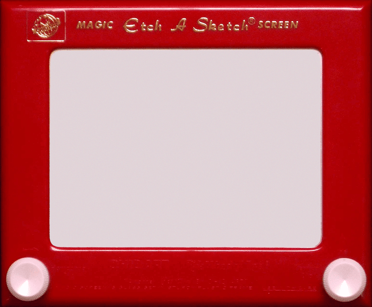

# **Etch-A-Sketch Project**
### This is a python version of Etch-A-Sketch game.    

    

### **<u>Libraries used:</u>**  
Turtle graphics

### **<u>Project:</u>**  
Etch A Sketch  
100 Days of Code - The Complete Python Pro Bootcamp 2021  
Day 19 - Intermediate - Instances, State and Higher Order Functions